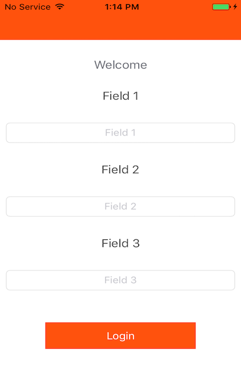
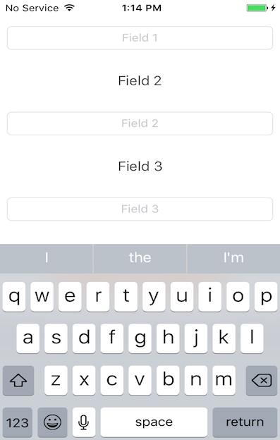

# iOS-Manage-Keyboard
Fixing UITextField keyboard Overlapping Problems - iOS Swift 
## Table of Contents

<!-- START doctoc generated TOC please keep comment here to allow auto update -->
<!-- DON'T EDIT THIS SECTION, INSTEAD RE-RUN doctoc TO UPDATE -->

- [Instructions](#instructions)
- [screenshot](#screenshot)
- [Project Structure](#project-structure)
- [Build Configuration](#build-configuration)
- [Build Requirements](#build-requirements)
- [Hardware Requirements](#hardware-requirements)
- [License](#license)

<!-- END doctoc generated TOC please keep comment here to allow auto update -->

## Instructions
- Clone this repository into a location of your choosing, like your projects folder.
- Open Croober.xcworkspace project
- Build & Run the project in Simulator or iPhone

## Screenshot
 
## Project Structure:
    ├─ /SampleProject/
    |   ├─ Main.storyboard
    |   ├─ LaunchScreen.storyboard
    |   ├─ AppDelegate.swift 
    |   ├─ ViewController.swift
    |   ├─ Assets.xcassets
    |   ├─ LaunchScreen.storyboard
    |   ├─ info.plist                 #App Settings plist
    ├─ Products      
        
## Build Configuration:
You can change the below app configurations details in `info.plist`.
- api base url

## Build Requirements:
- iOS SDK 9.0 or above
- Swift 3 
- Xcode - 8.2 or above

## Hardware Requirements:
- iPhone with iOS version 9.0 or above 
 
## License

Copyright (c) MIT License - Yatheesan 
This source code is licensed under the  license.
